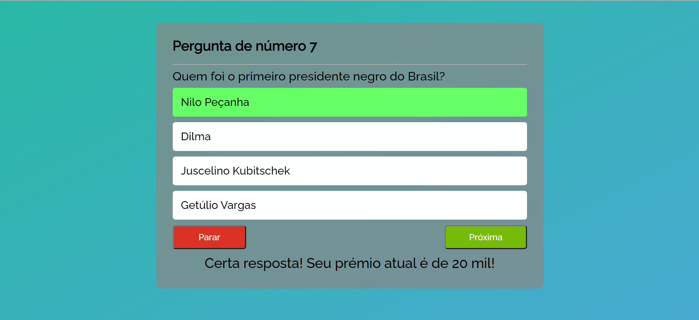
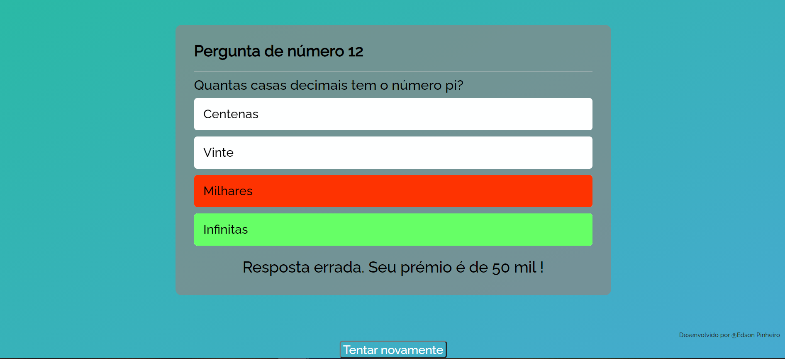

# Quiz-Milionario
O objetivo do jogo é simular o conceito inicial do Show do Milhão, e oferecer prêmios fictícios. 

The objective of the game is to simulate the initial concept of the 'Show do Milhão' and offer fiction prizes.

### Quiz-Milionario
[](https://github.com/Edson-Pinheiro/Quiz-do-Milhao/blob/master/LICENSE) 


# Sobre o projeto
Quiz-Milionario é uma aplicação front end web responsiva com telas mobile.
Esta aplicação web consiste em oferecer prêmios fictícios em Reais (BRL) e foi inspirada no jogo Show do Milhão*. 

*Show do Milhão foi um programa de televisão brasileiro de perguntas e respostas, que concedia um prêmio máximo de um milhão de reais. A atração era exibida pelo canal de televisão SBT e apresentada por Silvio Santos.   

# About the project
Millionaire Quiz is a responsive front end web application with mobile screens.
This web application consists of several fictional prizes in Reais (BRL) and was inspired by the game Show do Milhão*.
 
* 'Show do Milhão' was a Brazilian question and answer television program, which grants a maximum prize of one million reais.

## Layout web




## Layout mobile
  

# Tecnologias utilizadas / # Technologies used


## Front end
- HTML
- CSS
- JavaScript

# Como executar o projeto / How to run the project

https://quizmilionario.vercel.app/

```bash
# clonar repositório
git clone https://github.com/Edson-Pinheiro/Quiz-do-Milhao

# entrar na pasta do projeto e execucar o arquivo 'quiz.html'
(cmd)
start quiz.html
```

# Autor / Author

Edson Rodrigues Pinheiro Junior

https://www.linkedin.com/in/edson-pinheiro/

